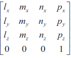
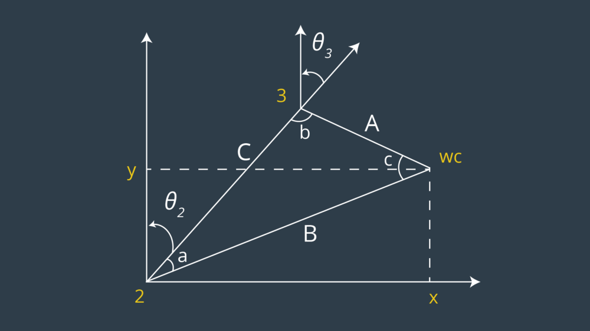
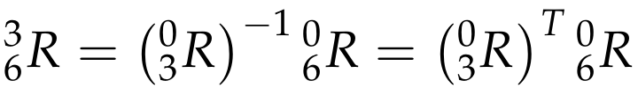

## Project: Kinematics Pick & Place Writeup

### Kinematic Analysis
#### 1. Run the forward_kinematics demo and evaluate the kr210.urdf.xacro file to perform kinematic analysis of Kuka KR210 robot and derive its DH parameters.

α(alpha) = arm twist angle
a = arm link length
d = arm link offset
θ = arm joint angle

joint | alpha | a | d | theta
--- | --- | --- | --- | ---
1 | 0       | 0     | 0.75  | q1
2 | -pi/2   | 0.35  | 0     | q2 - pi/2
3 |  0      | 1.25  | 0     | q3
4 | -pi/2   |-0.054 | 1.50  | q4
5 |  pi/2   | 0     | 0     | q5
6 | -pi/2   | 0     | 0     | q6
gripper | 0 | 0     | 0.303 | 0

#### 2. Using the DH parameter table you derived earlier, create individual transformation matrices about each joint. In addition, also generate a generalized homogeneous transform between base_link and gripper_link using only end-effector(gripper) pose.

T[i-1, i] = Pose (homogeneous transformation matrix) of coordinate-frame of joint b with respect to
coordinate- frame of joint a which represents both rotation and translation

Given the modified DH parameters the pose of a joint frame i with respect to the previous joint frame i-1 can be constructed as a sequence of four basic transformations:

T[i-1, i]  = R(x[i-1], alpha[i-1]) * D(x[i-1], a[i-1]) * R(z[i], theta[i]) * D(z[i], d[i])
1. First, a rotation about x[i-1] by alpha[i-1]
2. Then, a translation along x[i-1] by a[i-1]
3. Then, a rotation about resulting axis z[i] by theta[i]
4. Then, a translation along axis z[i] by d[i]

Which results to the following matrix:

    TF = Matrix([
            [cos(q), 		-sin(q), 		0, 		a],
    		[sin(q)*cos(alpha), 	cos(q)*cos(alpha), 	-sin(alpha), 	-sin(alpha)*d],
    		[sin(q)* sin(alpha), 	cos(q)*sin(alpha), 	cos(alpha), 	cos(alpha)*d],
    		[0,			0,			0,		1]
    ])
    

Substituting this matrix to the modified DH Parameters from the table above, we get the following transformation matrices about each joint with respect to the previous joint:

T01

cos(q1) | -sin(q1) | 0 | 0  
--- | --- | --- | ---
sin(q1) | cos(q1)|0 | 0     
0 | 0  | 1 |  0.75
0 |  0      | 0  | 1 

T12

sin(q2) |cos(q2) |0 |0.35 
--- | --- | --- | --- 
0 |0 |1 |0 
cos(q2) |-sin(q2)|0 |0 
0 |0 |0 |1 

T23

cos(q3) |-sin(q3)|0.0 |1.25 
--- | --- | --- | --- 
sin(q3) |cos(q3) |0 |0 
0 |0 |1 |0 
0 |0 |0 |1

T34

cos(q4) |-sin(q4)|0 |-0.054 
--- | --- | --- | --- 
0 |0 |1 |1.5 
-sin(q4)|-cos(q4)|0 |0 
0 |0 |0 |1 

T45

cos(q5) |-sin(q5)|0 |0 
--- | --- | --- | --- 
0 |0 |-1 |0 
sin(q5) |cos(q5) |0 |0 
0 |0 |0 |1 

T56

cos(q6) |-sin(q6)|0 |0 
--- | --- | --- | --- 
0 |0 |1 |0 
-sin(q6)|-cos(q6)|0 |0 
0 |0 |0 |1 

T6G

1 |0 |0 |0 
--- | --- | --- | --- 
0 |1 |0 |0 
0 |0 |1 |0.303 
0 |0 |0 |1 

# Generalized homogeneous transform
T0G = T01 * T12 * T23 * T34 * T45 * T56 * T6G

#### 3. Decouple Inverse Kinematics problem into Inverse Position Kinematics and inverse Orientation Kinematics; doing so derive the equations to calculate all individual joint angles.
 
# Inverse Position problem.

 Since we have the case of a spherical wrist involving joints 4,5,6, the position of the wrist center is governed by the first three joints. We can obtain the position of the wrist center by using the complete transformation matrix 
 

where l, m and n are orthonormal vectors representing the end-effector orientation along X, Y, Z axes of the local coordinate frame.

Since n is the vector along the z-axis of the gripper_link, we can say the following:

Where,

Px, Py, Pz = end-effector positions

Wx, Wy, Wz = wrist positions

d6 = from DH table

l = end-effector length

Now, in order to calculate nx, ny, and nz, let's continue from the previous section where we calculated the rotation matrix to correct the difference between the URDF and the DH reference frames for the end-effector.

- Rotation matrices

ROT_x = Matrix([[1, 0 , 0],
    [0, cos(r), -sin(r)],
	[0, sin(r), cos(r)]]) # ROLL

ROT_y = Matrix([
    [cos(p), 	0 , 	sin(p)],
    [0, 		1, 	0],
	[-sin(p), 	0, 	cos(p)]]) # PITCH

ROT_z = Matrix([[cos(y), -sin(y), 0],
    [sin(y), cos(y), 0],
    [0, 0, 1]]) # YAW

ROT_EE = ROT_z * ROT_y * ROT_x

- 180 degree counterclockwise rotation and 90degree clockwise rotation
	Rot_Error = ROT_z.subs(y, radians(180)) * ROT_y.subs(p, radians(-90))
	ROT_EE = ROT_EE * Rot_Error

	Extract end-effector position and orientation from request. But since roll, pitch, and yaw values for the gripper are returned in quaternions, we can use the transformations.py module from the TF package.
Now that we can know WC.

            ROT_EE = ROT_EE.subs({'r': roll, 'p': pitch, 'y': yaw})

            EE = Matrix([[px], [py], [pz]])

            WC = EE - (0.303) * ROT_EE[:,2]

# theta 1

θ1 = atan(yc.xc)
 Calculate Radius from above (will be used later)
r = sqrt(wx**2+wy**2) - 0.35 # a1: 0.35

# theta 2, 3

 Calculating Theta 2 and 3 using cosine law({\displaystyle c^{2}=a^{2}+b^{2}-2ab\cos \gamma}). A, B and C are sides of the triangle
 
A = 1.5014 # d4

B = sqrt(r**2+(wz-0.75)**2) # d1: 0.75

C = 1.25 # a2

  - a corresponds to angle alpha
 
a = acos((B**2 + C**2 - A**2) / (2*B*C))

theta2 = pi/2 - a - atan2(wz-0.75, r) # d1: 0.75

 - b corresponds to angle beta
 
b = acos((A**2 + C**2 - B**2) / (2*A*C))

theta3 = pi/2 - (b + 0.036)

#Inverse Orientation problems

### Project Implementation

#### 1. Fill in the `IK_server.py` file with properly commented python code for calculating Inverse Kinematics based on previously performed Kinematic Analysis. Your code must guide the robot to successfully complete 8/10 pick and place cycles. Briefly discuss the code you implemented and your results. 

Here I'll talk about the code, what techniques I used, what worked and why, where the implementation might fail and how I might improve it if I were going to pursue this project further.  

And just for fun, another example image:
![alt text][image3]

