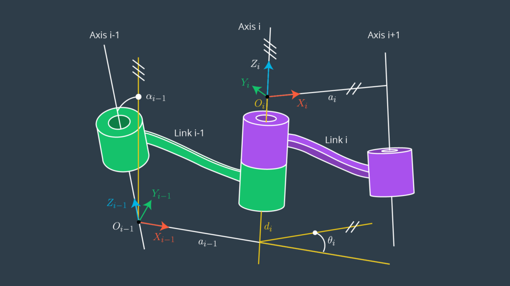

## Project: Kinematics Pick & Place Writeup

### Kinematic Analysis
#### 1. Run the forward_kinematics demo and evaluate the kr210.urdf.xacro file to perform kinematic analysis of Kuka KR210 robot and derive its DH parameters.

​ α(alpha) = arm twist angle
​ a = arm link length
​ d = arm link offset
​ θ = arm joint angle

joint | alpha | a | d | theta
--- | --- | --- | --- | ---
1 | 0       | 0     | 0.75  | q1
2 | -pi/2   | 0.35  | 0     | q2 - pi/2
3 |  0      | 1.25  | 0     | q3
4 | -pi/2   |-0.054 | 1.50  | q4
5 |  pi/2   | 0     | 0     | q5
6 | -pi/2   | 0     | 0     | q6
gripper | 0 | 0     | 0.303 | 0

#### 2. Using the DH parameter table you derived earlier, create individual transformation matrices about each joint. In addition, also generate a generalized homogeneous transform between base_link and gripper_link using only end-effector(gripper) pose.

Pose (homogeneous transformation matrix) of coordinate-frame of joint b ​with respect to
coordinate- frame of joint a ​which represents both rotation and translation

Given the modified DH parameters the pose of a joint frame i​ with respect to the previous joint frame i-1 ​can be constructed as a
sequence of four basic transformations:

T[i-1, i]  = R(​x[i-1], ​alpha[i-1]) ​*​ D(x​ [i-1], ​a[i-1]) ​*​ R(​z[i], ​theta[i]) ​*​ D(​z[i], ​d[i])
1. First, a rotation about x[i-1] by alpha[i-1]
2. Then, a translation along x[i-1] by a[i-1]
3. Then, a rotation about resulting axis z[i] by theta[i]
4. Then, a translation along axis z[i] by d[i]

Which results to the following matrix:

    TF = Matrix([
            [cos(q), 		-sin(q), 		0, 		a],
    		[sin(q)*cos(alpha), 	cos(q)*cos(alpha), 	-sin(alpha), 	-sin(alpha)*d],
    		[sin(q)* sin(alpha), 	cos(q)*sin(alpha), 	cos(alpha), 	cos(alpha)*d],
    		[0,			0,			0,		1]
    ])
    

Substituting this matrix to the modified DH Parameters from the table above, we get the following transformation matrices about each joint with respect to the previous joint:

cos(q1) | -sin(q1) | 0 | 0 
--- | --- | --- | --- 
sin(q1) | cos(q1)|0 | 0     
0 | 0  | 1 |  0.75
0 |  0      | 0  | 1 

sin(q2) |cos(q2) |0 |0.35 
0 |0 |1 |0 
cos(q2) |-sin(q2)|0 |0 
0 |0 |0 |1 

#### 3. Decouple Inverse Kinematics problem into Inverse Position Kinematics and inverse Orientation Kinematics; doing so derive the equations to calculate all individual joint angles.

And here's where you can draw out and show your math for the derivation of your theta angles. 

![alt text][image2]

### Project Implementation

#### 1. Fill in the `IK_server.py` file with properly commented python code for calculating Inverse Kinematics based on previously performed Kinematic Analysis. Your code must guide the robot to successfully complete 8/10 pick and place cycles. Briefly discuss the code you implemented and your results. 

Here I'll talk about the code, what techniques I used, what worked and why, where the implementation might fail and how I might improve it if I were going to pursue this project further.  

And just for fun, another example image:
![alt text][image3]

